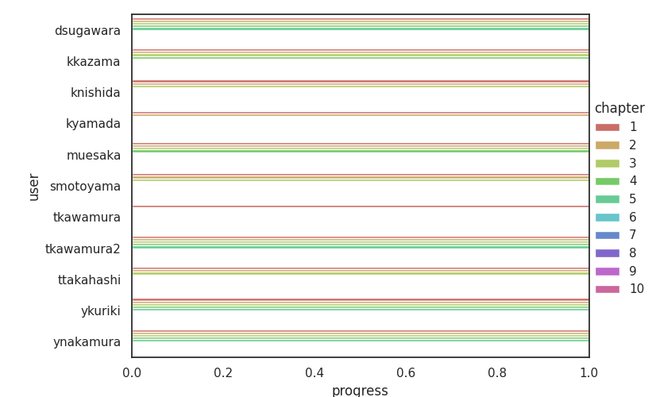

# 音響信号処理基礎勉強会

小野研新入生向けの音響信号処理勉強会

## 進め方

**現在検討中です．やりながら今後変わる可能性があります．**

- 1 時間で [演習問題](exercises.md) を解く
- 残りの時間で github にアップロード・レビューを行う

## 使い方

1. このレポジトリを fork する
2. fork したレポジトリを clone する
   ```
   $ git clone https://github.com/<user_name>/morise-asa.git
   ```
   `<user_name>` の部分は各自のユーザー名に置き換えてください
3. 新しいブランチを作る
   ブランチ名は `<ユーザー名>/<章>` としてください．
   例：中嶋が 1 章のコードを追加するとき → `tnakashima/chapter01`
   ```
   $ git branch <user_name>/chapter<XX>
   ```
4. コードを書く
   ファイル名は `chapter<章番号>/<問題番号>.py` とし，章番号・問題番号は 1 始まりの 2 桁に揃えてください．
   例：1 章の 1 個目 → `chapter01/01.py`
5. 新しく書いたコードを git の管理対象に追加する
   ```
   $ git add ./<user_name>/chpaterXX/YYY.py
   ```
6. 変更を記録する
   コミットメッセージは「○ 章を追加」などわかりやすい文章にしてください．
   ```
   $ git commit -m 'your message'
   ```
7. Remote repository の変更を pull する
   ```
   $ git pull
   ```
8. Remote repository に push する
   このとき， `<user_name>/chapter<XX>` は 2. で作成したブランチ名にしてください
   ```
   $ git push origin <user_name>/chapter<XX>
   ```
9. GitHub 上で pull request を作成する

## 注意事項

- わからないところは **積極的** に RA か研究室の人に聞いてください．
- **他の人のディレクトリを変更しないでください．**
  - 他の人のコードを閲覧したい場合は、Web サイト上から閲覧してください．
- フォルダ名，ファイル名を間違えると進捗グラフに反映されません．

## 進捗状況



## 謝辞

[小町研究室](https://github.com/tmu-nlp)のいくつかのリポジトリを参考にしました．
